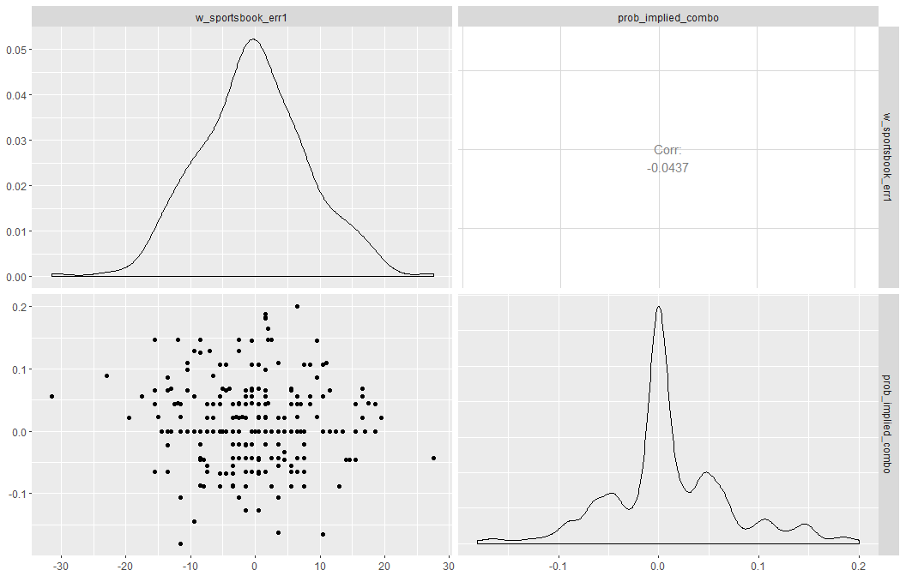
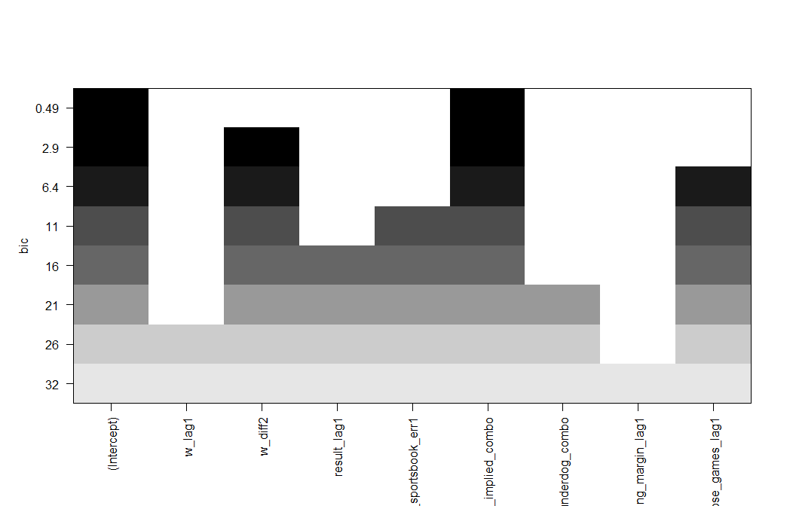
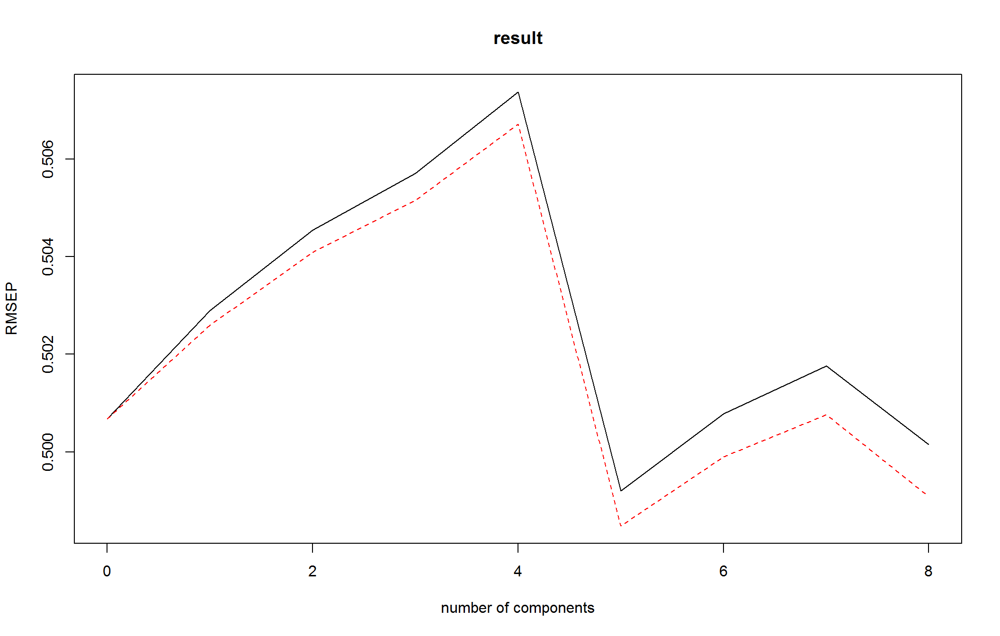
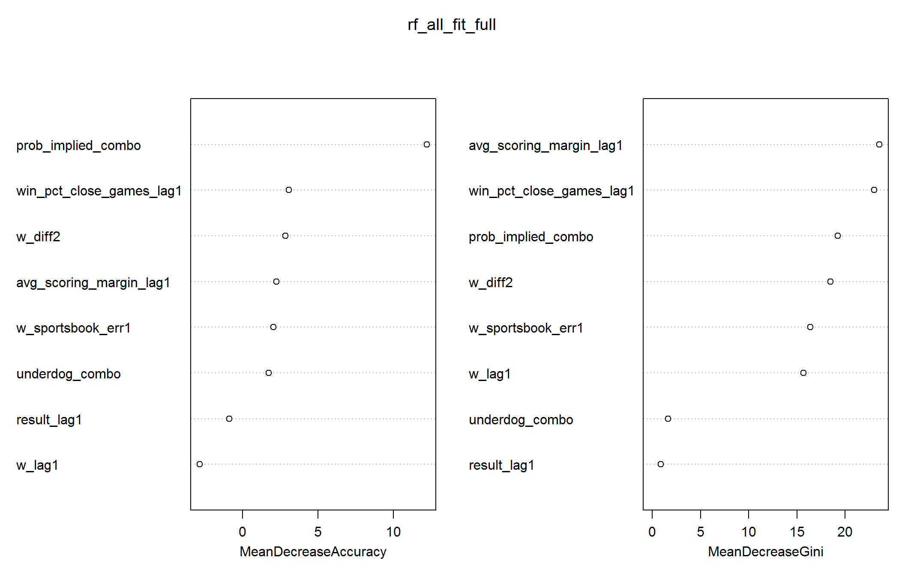

# Introduction

This project is no longer under development. See my more recent `nba` repo
for my current efforts on this subject.

This project (beginning around the time of my graduation from college in May 2016) was my first real dive into experimenting with machine learning models.
I initiated this project as a means of re-inforcing the concept that
I had learned in the
*Introduction to Statistical Learning with R (ISLR)* book. The proejct itself
explores the concept of improving NBA team win total predictions using team-level
statistics, Las Vegas odds, etc.
After developing some scripts to scrape data from websites like
(<https://www.basketball-reference.com>), 
I tried out various classification and linear regression techniques
to make predictions.

The primary deliverables of this projects are the `classification.R` and `linear_regression.R` scripts in the `R` folder. Both are formatted such that they can be converted directly to a .html or .pdf file
(using the `rmarkdown::render()` function). This was done with `classification.R`. (See the
`output` folder). On the other hand, the `linear_regression.R` script was never fully completed.

While there was no real goal of discovering a method to improve NBA win total predictions,
I found that no single classification method stood out as the best. In regards to predictors,
it appears that the error in the Las Vegas total for the previous season and the
implied odds (derived from the Las Vegas total) for a given season serve as the best
predictors.

# Highlights

## Correlations among Regressors

## Subsetting Regressors

## Principal Component Regression

## Random Forest

# Notes to Self

This project was **heavily** restuctured when cleaning it up for GitHub.
(Actually two projects were combined into one to create this one.)
The code that is in this repo cannot be expected to run properly without
some revising.

Also, this project was my first ever project with R programming, so the
coding style is probably something that should be emulated.

